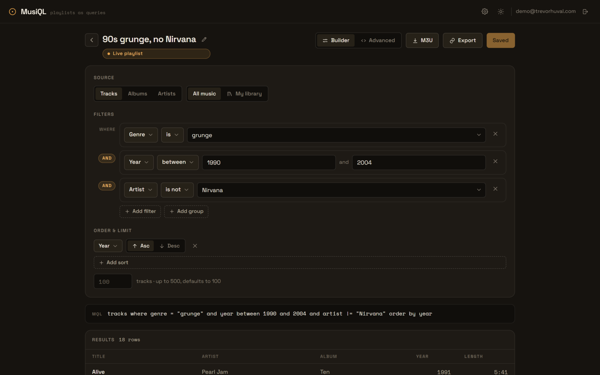
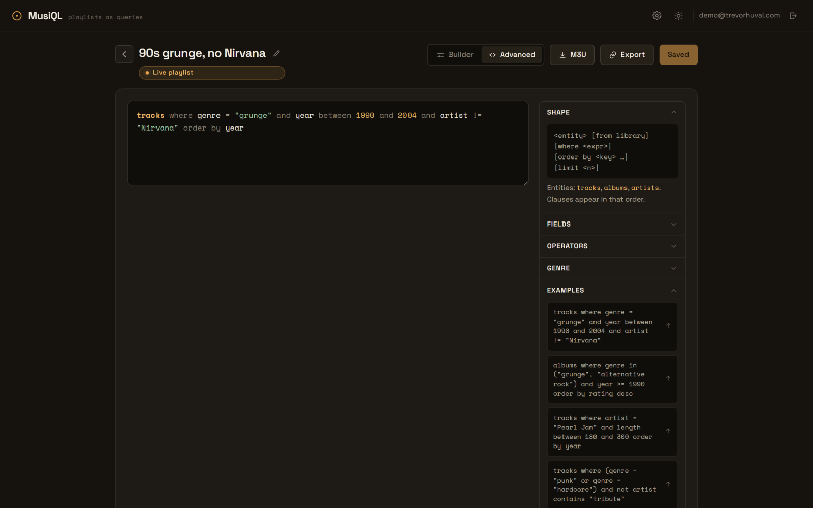

# MusiQL

[](https://github.com/TrevorHuval/musiql/actions/workflows/ci.yml) [](https://github.com/TrevorHuval/musiql/security/code-scanning) [](LICENSE)

**Live demo: [trevorhuval.com/musiql](https://trevorhuval.com/musiql)** — register an account and try the canonical query below. Deployed on AWS EC2 via GitHub Actions and multi-arch Docker images.



MusiQL is a web app where a playlist is a saved query rather than a hand-curated list. You describe what you want — say, grunge and alternative rock from 1990 to 2004, minus Nirvana — and MusiQL stores that definition and re-runs it against a music catalog every time the playlist is opened, so the result stays live as the catalog grows. There are two ways to write a query: a visual builder for casual use, and an advanced mode where fluent users write MQL, a small purpose-built query language. Users never write raw SQL; MQL is parsed to an AST on the server, validated against a whitelisted schema, and compiled to parameterized SQL.

The catalog is built from MusicBrainz PostgreSQL dumps, trimmed by an ETL pipeline into an app-owned schema holding just what queries need: artists, releases, recordings, genres, and dates. The backend is an ASP.NET Core (.NET 10) API over PostgreSQL; the frontend is React (Vite + TypeScript). MusiQL connects to Spotify to export a playlist to the user's account and to sync their saved tracks back into the library that `from library` queries read. The app carries the catalog ETL, the MQL query engine, an authenticated REST API, and a React client for building, previewing, and exporting playlists.



## Running locally

Prerequisites: [.NET 10 SDK](https://dotnet.microsoft.com/download), [Node 20+](https://nodejs.org), and [Docker](https://www.docker.com/products/docker-desktop). Make sure Docker is running before you start.

### Quick start

One script creates `.env`, starts PostgreSQL, loads the sample catalog, runs the backend tests, and installs the frontend dependencies:

```sh
# Windows (PowerShell)
./scripts/setup.ps1

# macOS / Linux
./scripts/setup.sh
```

When it finishes, start the two dev servers in separate terminals:

```sh
dotnet run --project src/MusiQL.Api    # API on http://localhost:5272
```

```sh
cd frontend && npm run dev             # app on http://127.0.0.1:5173
```

Open http://127.0.0.1:5173, register an account, and build a playlist. The sample catalog includes the 1990s grunge data behind the canonical example — try `tracks where genre = "grunge" and year between 1990 and 2004 and artist != "Nirvana"` in advanced mode. Use `127.0.0.1` rather than `localhost` so the Spotify redirect works.

### Manual setup

The script just automates these steps:

```sh
cp .env.example .env                                   # dev database credentials
docker compose up -d db                                # Postgres 17 on localhost:5442
dotnet run --project src/MusiQL.Etl -- load --sample   # load the sample catalog
dotnet test                                            # backend tests
dotnet run --project src/MusiQL.Api                    # API on http://localhost:5272
```

In a second terminal:

```sh
cd frontend
npm install
npm run dev                   # app on http://127.0.0.1:5173
```

`npm test` runs the frontend test suite.

### Production-ish stack

To run the published API and a built frontend (served by nginx, same-origin) instead of the dev servers, set `JWT_SIGNING_KEY` in `.env` and start the `prod` compose profile:

```sh
docker compose --profile prod up -d --build
dotnet run --project src/MusiQL.Etl -- load --sample   # load catalog into the compose db
```

The app is then at http://localhost:8088. The plain `docker compose up -d` (no profile) starts only Postgres for the dev workflow above.

In the Production environment the API refuses to start with a placeholder or short (< 32 bytes) `JWT_SIGNING_KEY` or Spotify key, and without a read-only `QUERY_CONNECTION` for MQL execution unless `QUERY_ALLOW_OWNER_CONNECTION=true` (fine locally, not on a public host). Postgres binds to loopback by default (`POSTGRES_BIND`), every container has bounded logs and a memory ceiling, and the API rate limits, per-user quotas and the global query admission limit are configurable under `Limits__*` and `Query__*`; see `.env.example`.

## Layout

| Path | Purpose |
| --- | --- |
| `src/MusiQL.Api` | ASP.NET Core Web API (minimal hosting) |
| `src/MusiQL.Core` | Domain model and MQL query engine |
| `src/MusiQL.Data` | EF Core / Npgsql data access and catalog schema |
| `src/MusiQL.Etl` | MusicBrainz catalog ETL (console) |
| `tests/MusiQL.Tests` | xUnit backend tests |
| `frontend` | React + Vite + TypeScript client |

## API

The API is authenticated with JWT bearer tokens (ASP.NET Identity, users stored in the `app` schema). Register or log in — `POST /api/auth/register`, `POST /api/auth/login` — to get an access token, then call the protected endpoints with `Authorization: Bearer <token>`. Refresh tokens rotate on `POST /api/auth/refresh`.

- Playlists are stored MQL definitions ("live views"): CRUD under `/api/playlists`, scoped to the owner, with `GET /api/playlists/{id}/tracks` executing the definition. `GET /api/playlists/{id}/export/m3u` downloads a track playlist as an `.m3u8` file.
- `POST /api/query/preview` validates and runs an ad-hoc MQL string, returning a result page or positional parse/validation errors the builder renders inline.
- `/api/catalog/{genres,artists,fields}` back the visual builder with autocomplete and schema metadata.

Errors are problem+json, preview/execute are rate limited, and CORS allows the Vite dev origin. In Development the `app` schema migrates on startup; catalog data comes from `etl load --sample`. Point `ConnectionStrings:Query` at the read-only `musiql_query` role in production (see `src/MusiQL.Data/Sql/query_role.sql`).

**TODO — email verification.** Registration does not verify email addresses yet; accounts are usable immediately after `POST /api/auth/register`.

## Spotify integration

Users connect their own Spotify account with the OAuth Authorization Code + PKCE flow, then export a playlist to Spotify and sync their saved tracks into their MusiQL library.

- `POST /api/spotify/connect` returns an authorize URL; the browser completes consent and returns to the redirect URI, which posts the code to `POST /api/spotify/callback`. `GET /api/spotify/status` and `POST /api/spotify/disconnect` manage the connection. Access and refresh tokens are stored per user in the `app` schema, encrypted at rest with AES-GCM; access tokens refresh automatically.
- `POST /api/playlists/{id}/export/spotify` runs the playlist's query and creates or updates a Spotify playlist named after it, adding matched tracks in order and reporting the ones it couldn't match. Re-exporting replaces the Spotify playlist's contents so it mirrors the live query. Matches are found by ISRC first (looked up from the MusicBrainz API and cached), then by an artist/title/duration search with a confidence score, and persisted (keyed by recording MBID) so re-exports are cheap.
- `POST /api/spotify/library/sync` reads the user's saved tracks, matches each back to a catalog recording, and reconciles `app.user_library` — new saves are added, un-saved tracks removed — so `from library` queries reflect the current library. Spotify rate limits are respected with batching and `Retry-After` backoff.

Configuration (a Spotify developer app is required). The client id, redirect URI, and a token-encryption key are read from the `Spotify` configuration section — provide them via environment variables or user-secrets, never commit real values:

```sh
export Spotify__ClientId=<your spotify app client id>
export Spotify__RedirectUri=http://127.0.0.1:5173/settings/spotify/callback
export Spotify__TokenEncryptionKey=$(openssl rand -base64 32)   # 32 bytes, base64
```

The redirect URI must be registered verbatim in the Spotify app dashboard. Spotify rejects `localhost` for loopback redirects, so use `127.0.0.1` (open the dev app at `http://127.0.0.1:5173`). PKCE is used for the token exchange, so no client secret is required; a `Spotify__ClientSecret` is neither used nor needed. A dev-only encryption key is set in `appsettings.Development.json` so local runs work out of the box.

## Catalog ETL

The `MusiQL.Etl` console builds the `catalog` schema from MusicBrainz PostgreSQL dumps. It imports only what playlist queries need — artists, release groups, recordings, genres, and the genre vote links between them — into a clean, app-owned schema. Releases are used during the load to decide which albums and tracks are official, but are not stored. Every row keeps its MusicBrainz MBID for later Spotify matching and dump refreshes.

```sh
dotnet run --project src/MusiQL.Etl -- load --sample   # load the checked-in dev fixture
dotnet run --project src/MusiQL.Etl -- download        # fetch the latest real dump tarballs
dotnet run --project src/MusiQL.Etl -- load            # load a downloaded dump
```

`load` applies EF migrations, streams each dump file into a `staging` schema with Npgsql binary COPY, reshapes it into the catalog with set-based SQL, then swaps the result into `catalog` in a single transaction. The swap `TRUNCATE`s and reinserts, which takes an exclusive lock on every catalog table, so reads block for the length of the reinsert (minutes for a full dump) and the loader gives up after 30 seconds if it cannot get the lock. Run a full refresh in a maintenance window, and build it on a separate host rather than the one serving traffic. Files are streamed line by line and never held in memory, so peak memory is flat regardless of dump size. The connection string resolves from `--connection`, then the `MUSIQL_CONNECTION` environment variable, then the local dev database on port 5442.

`--sample` loads `src/MusiQL.Etl/sample`, a hand-built mini-dump of ~50 artists across genres and eras (including the 1990s grunge catalog behind the canonical playlist example). Development and tests use it so the multi-gigabyte real dump is never required.

### Filtering rules

The catalog is a deliberately trimmed view of MusicBrainz. A row survives only when:

- **Official releases only.** A release is kept only when its MusicBrainz status is *Official*. Promos, bootlegs, and pseudo-releases are dropped.
- **No orphan albums.** A release group is kept only if it has at least one official release. Its first-release year and primary type come from MusicBrainz.
- **No artists without releases.** An artist is kept only if it is the credited artist of a surviving release group or recording.
- **Recordings resolved to an album.** A recording is kept only if it appears on an official release. Each recording MBID becomes exactly one catalog row; its album and year are taken from the earliest official release group it appears on, so the same recording across many releases collapses to a single track.
- **Genres are tag-derived.** MusicBrainz genres are the tags whose names match a genre, so each artist/album/recording genre link carries that tag's vote count. Tags that are not genres are ignored.

### Observed sizes and runtimes

| Source | Compressed size | Load |
| --- | --- | --- |
| Sample fixture | a few KB | ~2 s including migrations |
| `mbdump.tar.bz2` (core tables) | ~7 GB | download-bound; not run in this environment |
| `mbdump-derived.tar.bz2` (tags, meta) | ~480 MB | ~11 min to stage both tarballs |
| Full catalog after filters | 36M tracks, 12.4 GB on disk | ~2 h end to end on a desktop |
| `pg_dump -Fc` of the `catalog` schema | 2.1 GB | ~7 min `pg_restore -j 2` |

With covering `(genre_id, entity)` indexes on the genre link tables, representative queries against the full catalog run in under 0.5 s on Postgres capped at 768 MB. For small hosts, build the catalog elsewhere and ship it with `pg_dump`/`pg_restore` rather than running the ETL on the host. `load --min-genre-votes N` keeps only artists with at least N genre votes, but it removes surprisingly little because tagged artists own most of the recordings.

The download command's server contract (latest-export pointer, checksum manifest, tarball URLs) is verified against the live MetaBrainz mirror; a full real load was not executed here to conserve bandwidth.

## License

Copyright © 2026 Trevor Huval. Licensed under the [GNU General Public License v3.0](LICENSE). You may use, study, and modify this code, but any distributed derivative must also be released under the GPL-3.0. Catalog data originates from [MusicBrainz](https://musicbrainz.org) under its own licensing.
